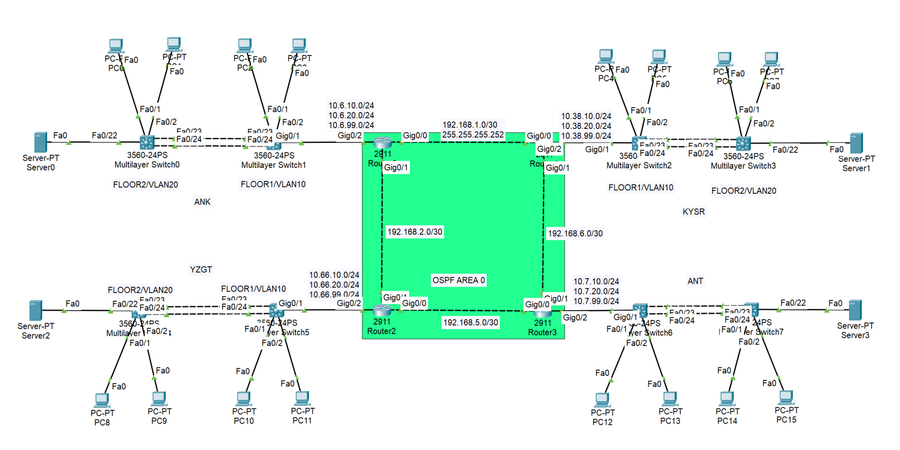
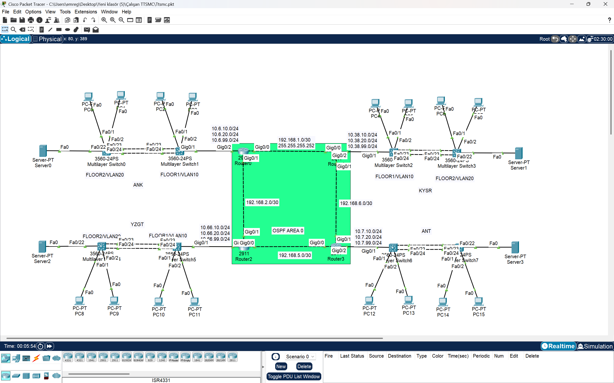
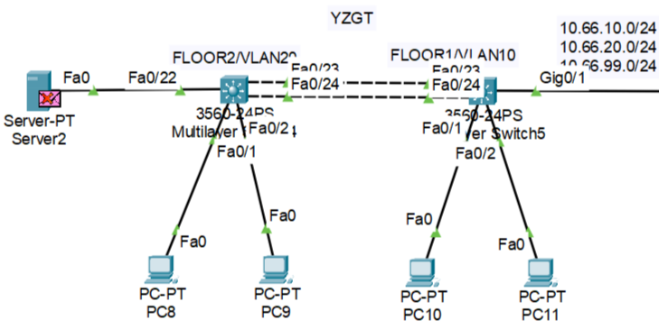
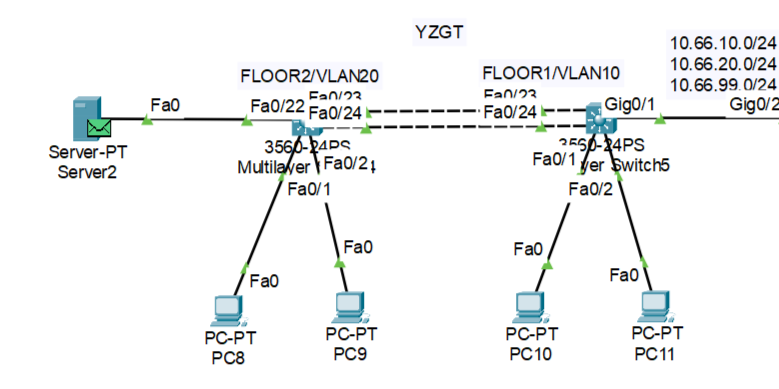
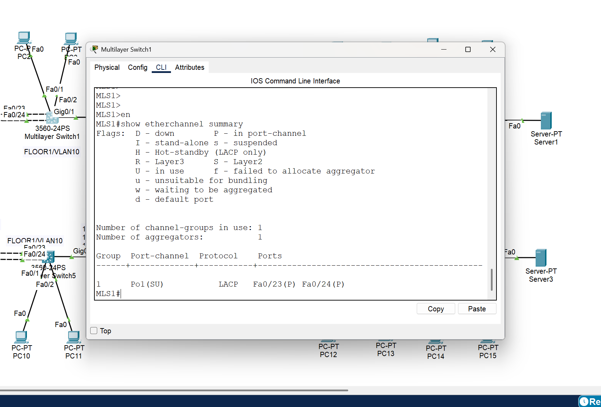
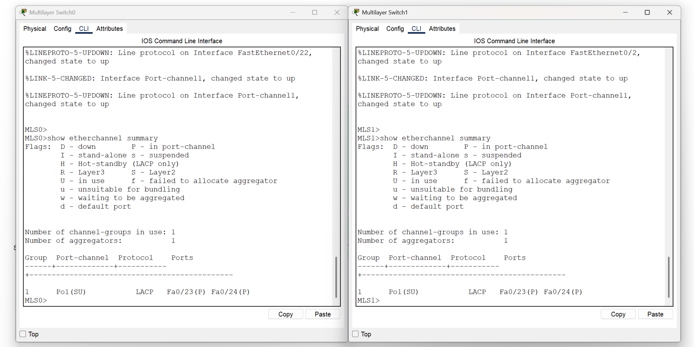
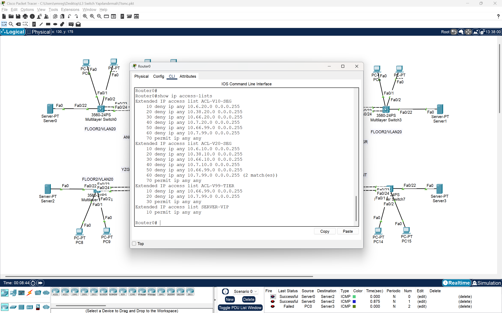

# Aegis Financial Network: Enterprise-Grade Infrastructure Modernization

> **[EN]** A comprehensive network transformation project demonstrating the migration from legacy Layer 3 switching to a modern Router-on-a-Stick (ROAS) architecture with Zero Trust security, OSPF backbone routing, and LACP redundancy across four financial branch locations in Turkey.
>
> **[TR]** Türkiye'deki dört finans şubesinde, eski Layer 3 switching mimarisinden modern Router-on-a-Stick (ROAS) mimarisine geçişi gösteren, Sıfır Güven güvenliği, OSPF omurga yönlendirmesi ve LACP yedekliliği içeren kapsamlı bir ağ dönüşüm projesi.


*Figure 1: The Final Modern Topology — Centralized ROAS Architecture with OSPF Backbone*

---

## 📑 Table of Contents / İçindekiler

- [Project Overview](#-project-overview--proje-genel-bakış)
- [The Problem: Legacy Architecture Failures](#-the-problem-legacy-architecture-failures--sorun-eski-mimari-hataları)
- [The Solution: Modern ROAS Architecture](#-the-solution-modern-roas-architecture--çözüm-modern-roas-mimarisi)
- [Complete Device Inventory](#-complete-device-inventory--tam-cihaz-envanteri)
- [IP Addressing & VLAN Planning](#-ip-addressing--vlan-planning--ip-adresleme-ve-vlan-planlaması)
- [Security Architecture: Zero Trust ACLs](#%EF%B8%8F-security-architecture-zero-trust-acls--güvenlik-mimarisi-sıfır-güven-acller)
- [OSPF Routing Design](#-ospf-routing-design--ospf-yönlendirme-tasarımı)
- [High Availability: LACP EtherChannel](#-high-availability-lacp-etherchannel--yüksek-erişilebilirlik-lacp-etherchannel)
- [Verification & Evidence](#-verification--evidence--doğrulama-ve-kanıtlar)
- [Technical Specifications](#-technical-specifications--teknik-özellikler)
- [Repository Structure](#-repository-structure--depo-yapısı)
- [Skills Demonstrated & Learning Outcomes](#-skills-demonstrated--learning-outcomes--gösterilen-yetenekler-ve-öğrenme-çıktıları)

---

## 🚀 Project Overview / Proje Genel Bakış

**[EN]** The **Aegis Financial Network** project represents a real-world enterprise infrastructure modernization initiative for a multi-branch financial institution operating across four major Turkish cities: **Ankara (HQ)**, **Kayseri**, **Yozgat**, and **Antalya (DR)**. 

The network hosts critical financial servers, departmental workstations, and requires stringent security segmentation between Engineering (VLAN 10) and HR/Finance (VLAN 20) departments. The legacy architecture suffered from distributed routing conflicts that disrupted server-to-server replication—a critical failure for financial data integrity.

This project showcases the complete migration to a centralized **Router-on-a-Stick (ROAS)** architecture with **802.1Q encapsulation**, **OSPF Area 0 backbone routing**, **LACP link aggregation**, and **tiered Extended ACL security policies**.

**[TR]** **Aegis Financial Network** projesi, Türkiye'nin dört büyük şehrinde faaliyet gösteren çok şubeli bir finans kurumu için gerçek dünya kurumsal altyapı modernizasyonu girişimini temsil etmektedir: **Ankara (Genel Merkez)**, **Kayseri**, **Yozgat** ve **Antalya (Felaket Kurtarma)**.

Ağ, kritik finansal sunucular, departman iş istasyonları barındırır ve Mühendislik (VLAN 10) ile İK/Finans (VLAN 20) departmanları arasında katı güvenlik segmentasyonu gerektirir. Eski mimari, sunucular arası replikasyonu kesintiye uğratan dağıtık yönlendirme çakışmalarından muzdaripti—finansal veri bütünlüğü için kritik bir hata.

Bu proje, **802.1Q kapsülleme**, **OSPF Area 0 omurga yönlendirmesi**, **LACP link toplama** ve **katmanlı Genişletilmiş ACL güvenlik politikaları** ile merkezi bir **Router-on-a-Stick (ROAS)** mimarisine tam geçişi sergiliyor.

---

## ❌ The Problem: Legacy Architecture Failures / Sorun: Eski Mimari Hataları

### Legacy vs Modern Topology Comparison / Topoloji Karşılaştırması

| **Legacy Architecture (v1) — FAILED ❌** | **Modern Architecture (v2) — SOLVED ✅** |
|:---:|:---:|
|  |  |
| *Layer 3 Switching with Distributed SVIs* <br> *(Dağıtık SVI'ler ile Layer 3 Switching)* | *Router-on-a-Stick with Centralized Routing* <br> *(Merkezi Yönlendirme ile ROAS)* |

---

### Legacy Architecture (v1): Layer 3 Switching Model

**[EN]** The original network design utilized **Layer 3 Switching** with inter-VLAN routing performed on Multilayer Switches (MLS) using Switch Virtual Interfaces (SVIs). While this approach can work in smaller networks, it created critical problems in this multi-site financial environment:

**Critical Issues:**

1. **ACL Conflicts & Routing Inconsistencies**
   - Each Core MLS switch (MLS1, MLS2, MLS5, MLS6) performed independent routing with SVIs for VLAN 10, 20, and 99
   - Access Control Lists applied to SVIs conflicted across switches, creating unpredictable traffic patterns
   - No single source of truth for security policies

2. **Server Replication Failure (Fatal Flaw)**
   - **VLAN 99** hosts critical financial servers requiring continuous data replication
   - Distributed ACLs on different switches blocked inter-site server communication
   - **Evidence:** Server ping failures shown in screenshot below

3. **Troubleshooting Complexity**
   - Multiple routing points made path tracing extremely difficult
   - ACL match counters scattered across 8 switches
   - No centralized policy enforcement

**[TR]** Orijinal ağ tasarımı, Çok Katmanlı Anahtarlar (MLS) üzerinde Switch Virtual Interface'ler (SVI'ler) kullanarak VLAN'lar arası yönlendirme gerçekleştiren **Layer 3 Switching** kullandı. Bu yaklaşım küçük ağlarda işe yarayabilse de, bu çok siteli finans ortamında kritik sorunlar oluşturdu:

**Kritik Sorunlar:**
- ACL çakışmaları ve yönlendirme tutarsızlıkları
- **VLAN 99** sunucu replikasyonu hatası (Ölümcül sorun)
- Karmaşık sorun giderme

### Critical Failure Evidence / Kritik Hata Kanıtı

| **Legacy (v1) — Server Replication BLOCKED ❌** | **Modern (v2) — Server Connectivity RESTORED ✅** |
|:---:|:---:|
|  |  |
| *Server0 → Server2 ping **FAILED*** <br> *(VLAN 99 sunucular arası iletişim ENGELLENDİ)* | *Server0 → Server2 ping **SUCCESS*** <br> *(VLAN 99 sunucular arası iletişim ÇALIŞIYOR)* |

### Architecture Comparison / Mimari Karşılaştırması

| **Aspect / Özellik** | **Legacy (v1) — L3 Switching** | **Modern (v2) — ROAS** |
|:---|:---|:---|
| **Routing Location** <br> *(Yönlendirme Konumu)* | Distributed across MLS switches <br> *(MLS anahtarlarına dağıtılmış)* | Centralized on Cisco 2911 Routers <br> *(Cisco 2911 Router'larda merkezi)* |
| **Inter-VLAN Method** <br> *(VLAN Arası Yöntem)* | SVI (Switch Virtual Interface) | 802.1Q Subinterfaces (Gi0/2.10, .20, .99) |
| **ACL Enforcement** <br> *(ACL Uygulaması)* | Inconsistent, per-switch SVIs <br> *(Tutarsız, anahtar başına SVI)* | Unified, per-site router subinterfaces <br> *(Birleşik, site başına router alt arayüzleri)* |
| **Server VLAN 99 Status** | ❌ **BLOCKED** — Replication failed | ✅ **OPERATIONAL** — Full connectivity restored |
| **Troubleshooting** <br> *(Sorun Giderme)* | Complex, 8 routing points <br> *(Karmaşık, 8 yönlendirme noktası)* | Simplified, 4 routing points <br> *(Basitleştirilmiş, 4 yönlendirme noktası)* |
| **Security Model** <br> *(Güvenlik Modeli)* | Distributed, conflicting policies <br> *(Dağıtık, çakışan politikalar)* | Centralized, tiered ACL hierarchy <br> *(Merkezi, katmanlı ACL hiyerarşisi)* |

### EtherChannel Implementation Comparison / EtherChannel Uygulama Karşılaştırması

| **Legacy (v1) — Present but Ineffective** | **Modern (v2) — Fully Operational** |
|:---:|:---:|
|  |  |
| *EtherChannel configured but routing conflicts remained* <br> *(EtherChannel yapılandırılmış ancak yönlendirme çakışmaları devam ediyor)* | *EtherChannel + ROAS = Full redundancy achieved* <br> *(EtherChannel + ROAS = Tam yedeklilik sağlandı)* |

---

## ✅ The Solution: Modern ROAS Architecture / Çözüm: Modern ROAS Mimarisi

### Modern Architecture (v2): Router-on-a-Stick Model

**[EN]** The modernized architecture implements **Router-on-a-Stick (ROAS)** with **802.1Q VLAN encapsulation**, completely eliminating distributed routing. All switches operate purely at Layer 2, while Cisco 2911 routers handle all inter-VLAN routing through subinterfaces.

**Key Design Principles:**

### 1. **802.1Q Subinterface Architecture**

Each router uses a single physical GigabitEthernet interface (Gi0/2) divided into three logical subinterfaces:

```cisco
interface GigabitEthernet0/2
 description Trunk to MLS (ROAS Uplink)
 no ip address
 duplex auto
 speed auto

interface GigabitEthernet0/2.10
 description VLAN 10 - Engineering Department
 encapsulation dot1Q 10
 ip address 10.6.10.1 255.255.255.0
 ip access-group ACL-V10-SEG in
 ip ospf 1 area 0

interface GigabitEthernet0/2.20
 description VLAN 20 - HR/Finance Department
 encapsulation dot1Q 20
 ip address 10.6.20.1 255.255.255.0
 ip access-group ACL-V20-SEG in
 ip ospf 1 area 0

interface GigabitEthernet0/2.99
 description VLAN 99 - Server Farm
 encapsulation dot1Q 99
 ip address 10.6.99.1 255.255.255.0
 ip access-group ACL-V99-TIER in
 ip ospf 1 area 0
```

**Benefits:**
- **Single routing device per site** — No ACL conflicts
- **Centralized policy enforcement** — All ACLs in one configuration context
- **Consistent traffic paths** — Predictable routing behavior

### 2. **Layer 2-Only Switches**

All Catalyst 3560 switches reconfigured to pure Layer 2 operation:

```cisco
no ip routing                          ! Disable Layer 3 routing
!
interface Vlan10
 no ip address
 shutdown
!
interface Vlan20
 no ip address
 shutdown
!
interface Vlan99
 no ip address
 shutdown
```

**[TR]** Modernize edilmiş mimari, dağıtık yönlendirmeyi tamamen ortadan kaldıran **802.1Q VLAN kapsülleme** ile **Router-on-a-Stick (ROAS)** uygular. Tüm anahtarlar tamamen Layer 2'de çalışırken, Cisco 2911 router'lar alt arayüzler aracılığıyla tüm VLAN'lar arası yönlendirmeyi gerçekleştirir.

---

## 📋 Complete Device Inventory / Tam Cihaz Envanteri

### Network Devices (Infrastructure)

| **Device** | **Model** | **Role** | **Location** | **Management IP** |
|:---|:---|:---|:---|:---|
| Router0 | Cisco 2911 | HQ Gateway & OSPF Neighbor | Ankara | 192.168.10.1 |
| Router1 | Cisco 2911 | Site Gateway & OSPF Neighbor | Kayseri | 192.168.11.1 |
| Router2 | Cisco 2911 | Site Gateway & OSPF Neighbor | Yozgat | 192.168.12.1 |
| Router3 | Cisco 2911 | DR Gateway & OSPF Neighbor | Antalya | 192.168.13.1 |
| MLS0 | Catalyst 3560 | Ankara Access Switch | Ankara | DHCP/Manual |
| MLS1 | Catalyst 3560 | Ankara Distribution Switch | Ankara | DHCP/Manual |
| MLS2 | Catalyst 3560 | Kayseri Distribution Switch | Kayseri | DHCP/Manual |
| MLS3 | Catalyst 3560 | Kayseri Access Switch | Kayseri | DHCP/Manual |
| MLS4 | Catalyst 3560 | Yozgat Access Switch | Yozgat | DHCP/Manual |
| MLS5 | Catalyst 3560 | Yozgat Distribution Switch | Yozgat | DHCP/Manual |
| MLS6 | Catalyst 3560 | Antalya Distribution Switch | Antalya | DHCP/Manual |
| MLS7 | Catalyst 3560 | Antalya Access Switch | Antalya | DHCP/Manual |

### End Devices: Servers (VLAN 99)

| **Device** | **Location** | **VLAN** | **IPv4 Address** | **Subnet Mask** | **Default Gateway** | **IPv6 Link-Local** |
|:---|:---|:---:|:---|:---|:---|:---|
| Server0 | Ankara (HQ) | 99 | 10.6.99.10 | 255.255.255.0 | 10.6.99.1 | FE80::260:3EFF:FE75:AB92 |
| Server1 | Kayseri | 99 | 10.38.99.10 | 255.255.255.0 | 10.38.99.1 | FE80::205:5EFF:FE49:2DC0 |
| Server2 | Yozgat | 99 | 10.66.99.10 | 255.255.255.0 | 10.66.99.1 | FE80::201:42FF:FEA5:A4D1 |
| Server3 | Antalya (DR) | 99 | 10.7.99.10 | 255.255.255.0 | 10.7.99.1 | FE80::2E0:8FFF:FE28:D21C |

### End Devices: Workstations (VLAN 10 & 20)

| **Device** | **Location** | **VLAN** | **Department** | **IPv4 Address** | **Subnet Mask** | **Default Gateway** | **IPv6 Link-Local** |
|:---|:---|:---:|:---|:---|:---|:---|:---|
| PC0 | Ankara | 20 | HR/Finance | 10.6.20.21 | 255.255.255.0 | 10.6.20.1 | FE80::230:F2FF:FEA9:E633 |
| PC1 | Ankara | 20 | HR/Finance | 10.6.20.22 | 255.255.255.0 | 10.6.20.1 | FE80::250:FFF:FE3E:4AB |
| PC2 | Ankara | 10 | Engineering | 10.6.10.11 | 255.255.255.0 | 10.6.10.1 | FE80::2D0:D3FF:FE44:395E |
| PC3 | Ankara | 10 | Engineering | 10.6.10.12 | 255.255.255.0 | 10.6.10.1 | FE80::20A:41FF:FE8A:A303 |
| PC4 | Kayseri | 10 | Engineering | 10.38.10.11 | 255.255.255.0 | 10.38.10.1 | FE80::201:43FF:FE72:4548 |
| PC5 | Kayseri | 10 | Engineering | 10.38.10.12 | 255.255.255.0 | 10.38.10.1 | FE80::201:96FF:FEDD:C162 |
| PC6 | Kayseri | 20 | HR/Finance | 10.38.20.21 | 255.255.255.0 | 10.38.20.1 | FE80::20B:BEFF:FE47:8E7A |
| PC7 | Kayseri | 20 | HR/Finance | 10.38.20.22 | 255.255.255.0 | 10.38.20.1 | FE80::201:97FF:FE50:9979 |
| PC8 | Yozgat | 20 | HR/Finance | 10.66.20.21 | 255.255.255.0 | 10.66.20.1 | FE80::202:17FF:FEDE:521C |
| PC9 | Yozgat | 20 | HR/Finance | 10.66.20.22 | 255.255.255.0 | 10.66.20.1 | FE80::2E0:F7FF:FEBD:3869 |
| PC10 | Yozgat | 10 | Engineering | 10.66.10.11 | 255.255.255.0 | 10.66.10.1 | FE80::20B:BEFF:FEA2:A726 |
| PC11 | Yozgat | 10 | Engineering | 10.66.10.12 | 255.255.255.0 | 10.66.10.1 | FE80::290:2BFF:FEAE:D2EB |
| PC12 | Antalya | 10 | Engineering | 10.7.10.11 | 255.255.255.0 | 10.7.10.1 | FE80::2D0:D3FF:FEB3:88A4 |
| PC13 | Antalya | 10 | Engineering | 10.7.10.12 | 255.255.255.0 | 10.7.10.1 | FE80::201:43FF:FEC1:9EDD |
| PC14 | Antalya | 20 | HR/Finance | 10.7.20.21 | 255.255.255.0 | 10.7.20.1 | FE80::260:3EFF:FEEB:3D6B |
| PC15 | Antalya | 20 | HR/Finance | 10.7.20.22 | 255.255.255.0 | 10.7.20.1 | FE80::2E0:8FFF:FEEB:DE0E |

**Total Endpoints:** 4 Routers, 8 Switches, 4 Servers, 16 Workstations = **32 managed devices**

---

## 🌐 IP Addressing & VLAN Planning / IP Adresleme ve VLAN Planlaması

### Branch Network Subnets

| **Location** | **Role** | **Network Prefix** | **Assignable Range** | **Total Hosts** |
|:---|:---|:---:|:---|:---:|
| **Ankara (ANK)** | Headquarters & Main Data Center | `10.6.0.0/16` | 10.6.0.1 – 10.6.255.254 | 65,534 |
| **Kayseri (KYSR)** | Operations Branch | `10.38.0.0/16` | 10.38.0.1 – 10.38.255.254 | 65,534 |
| **Yozgat (YZGT)** | Archive Site | `10.66.0.0/16` | 10.66.0.1 – 10.66.255.254 | 65,534 |
| **Antalya (ANT)** | Disaster Recovery Site | `10.7.0.0/16` | 10.7.0.1 – 10.7.255.254 | 65,534 |

### VLAN Scheme & Gateway Assignments

| **VLAN ID** | **Purpose / Department** | **Ankara** | **Kayseri** | **Yozgat** | **Antalya** |
|:---:|:---|:---|:---|:---|:---|
| **10** | Engineering / IT | `10.6.10.0/24` <br> GW: `.1` | `10.38.10.0/24` <br> GW: `.1` | `10.66.10.0/24` <br> GW: `.1` | `10.7.10.0/24` <br> GW: `.1` |
| **20** | HR / Finance | `10.6.20.0/24` <br> GW: `.1` | `10.38.20.0/24` <br> GW: `.1` | `10.66.20.0/24` <br> GW: `.1` | `10.7.20.0/24` <br> GW: `.1` |
| **99** | Server Farm / Data Center | `10.6.99.0/24` <br> GW: `.1` | `10.38.99.0/24` <br> GW: `.1` | `10.66.99.0/24` <br> GW: `.1` | `10.7.99.0/24` <br> GW: `.1` |

**Design Notes:**
- **Consistent VLAN Scheme:** All four sites use identical VLAN IDs (10, 20, 99) for departmental segmentation
- **Hierarchical Addressing:** Second octet identifies the branch (6=Ankara, 38=Kayseri, 66=Yozgat, 7=Antalya)
- **Gateway Convention:** Always `.1` suffix for default gateways (router subinterfaces)
- **Scalability:** /16 prefix provides 65K hosts per site, allowing massive expansion

### OSPF Backbone Links (Router Ring Topology)

| **Link** | **Interface** | **Network** | **Purpose** |
|:---|:---|:---:|:---|
| R0 ↔ R1 | Gi0/0 ↔ Gi0/0 | `192.168.1.0/30` | Ankara – Kayseri WAN |
| R1 ↔ R3 | Gi0/1 ↔ Gi0/0 | `192.168.6.0/30` | Kayseri – Antalya WAN |
| R3 ↔ R2 | Gi0/1 ↔ Gi0/1 | `192.168.5.0/30` | Antalya – Yozgat WAN |
| R2 ↔ R0 | Gi0/0 ↔ Gi0/1 | `192.168.2.0/30` | Yozgat – Ankara WAN |

**Topology Benefit:** Redundant ring ensures any single router or link failure still maintains network connectivity via alternate paths.

---

## 🛡️ Security Architecture: Zero Trust ACLs / Güvenlik Mimarisi: Sıfır Güven ACL'ler

### Security Philosophy

**[EN]** The network implements a **Zero Trust** security model using **Named Extended Access Control Lists** applied inbound on router subinterfaces. This ensures all inter-VLAN traffic is inspected and filtered before routing occurs.

**Three-Tier ACL Hierarchy:**
1. **ACL-V10-SEG** — Engineering (VLAN 10) Restrictions
2. **ACL-V20-SEG** — HR/Finance (VLAN 20) Restrictions
3. **ACL-V99-TIER** — Server Farm (VLAN 99) Geo-Blocking

**[TR]** Ağ, router alt arayüzlerine gelen yönde uygulanan **İsimlendirilmiş Genişletilmiş Erişim Kontrol Listeleri** kullanarak bir **Sıfır Güven** güvenlik modeli uygular. Bu, tüm VLAN'lar arası trafiğin yönlendirme gerçekleşmeden önce incelenip filtrelenmesini sağlar.

### ACL-V10-SEG: Engineering Department Restrictions

**Policy Goal:** Allow Engineering access to servers and other VLANs EXCEPT HR/Finance departments and select remote servers.

**Representative Rules:**

```cisco
ip access-list extended ACL-V10-SEG
 deny   ip any 10.6.20.0 0.0.0.255      ! Block local HR (Ankara)
 deny   ip any 10.38.20.0 0.0.0.255     ! Block Kayseri HR
 deny   ip any 10.66.20.0 0.0.0.255     ! Block Yozgat HR
 deny   ip any 10.7.20.0 0.0.0.255      ! Block Antalya HR
 deny   ip any 10.66.99.0 0.0.0.255     ! Block Yozgat Archive Servers
 deny   ip any 10.7.99.0 0.0.0.255      ! Block Antalya DR Servers
 permit ip any any                       ! Allow all other traffic
```

**Logic:**
- Engineering staff cannot access HR/Finance workstations (data privacy)
- Engineering cannot access Yozgat and Antalya server farms (geo-restriction for sensitive archives)

### ACL-V20-SEG: HR/Finance Department Restrictions

**Policy Goal:** Isolate HR/Finance completely from Engineering while restricting server access.

**Representative Rules:**

```cisco
ip access-list extended ACL-V20-SEG
 deny   ip any 10.6.10.0 0.0.0.255      ! Block Ankara Engineering
 deny   ip any 10.38.10.0 0.0.0.255     ! Block Kayseri Engineering
 deny   ip any 10.66.10.0 0.0.0.255     ! Block Yozgat Engineering
 deny   ip any 10.7.10.0 0.0.0.255      ! Block Antalya Engineering
 deny   ip any 10.66.99.0 0.0.0.255     ! Block Yozgat Archive Servers
 deny   ip any 10.7.99.0 0.0.0.255      ! Block Antalya DR Servers
 permit ip any any                       ! Allow remaining traffic
```

**Logic:**
- HR/Finance cannot communicate with Engineering (departmental segmentation)
- Same server geo-blocking as Engineering

### ACL-V99-TIER: Server Geo-Blocking

**Policy Goal:** Protect Yozgat (Archive) and Antalya (DR) server farms from general branch access. Only authorized administrator access permitted.

**Representative Rules (Applied on Router1, Router2, Router3):**

```cisco
ip access-list extended ACL-V99-TIER
 deny   ip any 10.66.99.0 0.0.0.255     ! Prevent access to Yozgat Servers
 deny   ip any 10.7.99.0 0.0.0.255      ! Prevent access to Antalya DR Servers
 permit ip any any                       ! Allow other server communication
```

**Logic:**
- Archive and DR sites isolated from routine operational access
- Server-to-server replication within VLAN 99 still functions (inter-VLAN rule doesn't apply)
- Administrators must use dedicated management access (not shown in user VLANs)

### ACL Application on Router Subinterfaces

```cisco
interface GigabitEthernet0/2.10
 ip access-group ACL-V10-SEG in          ! Inbound filtering for VLAN 10 traffic

interface GigabitEthernet0/2.20
 ip access-group ACL-V20-SEG in          ! Inbound filtering for VLAN 20 traffic

interface GigabitEthernet0/2.99
 ip access-group ACL-V99-TIER in         ! Inbound filtering for VLAN 99 traffic
```

**Security Benefits:**
- **Defense in Depth:** Traffic filtered at ingress before routing decisions
- **Centralized Management:** All ACLs in single router configuration
- **Auditability:** `show ip access-lists` provides match counters for compliance
- **Consistency:** Same ACL logic replicated across all four sites

---

## 🔀 OSPF Routing Design / OSPF Yönlendirme Tasarımı

### Protocol Configuration

**[EN]** The network uses **OSPFv2 (Open Shortest Path First)** with a single-area design for simplicity and full mesh reachability.

**OSPF Parameters:**
- **Process ID:** 1 (consistent across all routers)
- **Area:** 0 (Backbone Area only)
- **Network Type:** Point-to-Point on WAN links, Broadcast on LAN subinterfaces
- **Authentication:** Not configured (isolated private network)

**[TR]** Ağ, basitlik ve tam ağ erişilebilirliği için tek alan tasarımıyla **OSPFv2 (Open Shortest Path First)** kullanır.

### Router Topology: Redundant Ring

```
        R0 (Ankara)
       /  \          \
      /    \          \
     /      \          \
R1 (Kayseri) ---------- R2 (Yozgat)
     \                 /
      \               /
       \             /
        R3 (Antalya)
```

### OSPF Network Advertisements

**Router0 (Ankara):**
- WAN Links: 192.168.1.0/30, 192.168.2.0/30
- LAN Subnets: 10.6.10.0/24, 10.6.20.0/24, 10.6.99.0/24

**Router1 (Kayseri):**
- WAN Links: 192.168.1.0/30, 192.168.6.0/30
- LAN Subnets: 10.38.10.0/24, 10.38.20.0/24, 10.38.99.0/24

**Router2 (Yozgat):**
- WAN Links: 192.168.2.0/30, 192.168.5.0/30
- LAN Subnets: 10.66.10.0/24, 10.66.20.0/24, 10.66.99.0/24

**Router3 (Antalya):**
- WAN Links: 192.168.5.0/30, 192.168.6.0/30
- LAN Subnets: 10.7.10.0/24, 10.7.20.0/24, 10.7.99.0/24

### OSPF Interface Configuration

```cisco
router ospf 1
 log-adjacency-changes
 passive-interface default
 no passive-interface GigabitEthernet0/0
 no passive-interface GigabitEthernet0/1
 no passive-interface GigabitEthernet0/2.10
 no passive-interface GigabitEthernet0/2.20
 no passive-interface GigabitEthernet0/2.99

interface GigabitEthernet0/2.10
 ip ospf 1 area 0

interface GigabitEthernet0/2.20
 ip ospf 1 area 0

interface GigabitEthernet0/2.99
 ip ospf 1 area 0
```

**Routing Outcome:**
- All 4 routers form full OSPF adjacencies
- Every branch subnet reachable from every other branch
- Redundant paths provide automatic failover if any link fails
- Server VLAN 99 fully routable across all sites (problem solved!)

---

## ⚡ High Availability: LACP EtherChannel / Yüksek Erişilebilirlik: LACP EtherChannel

### Link Aggregation Design

**[EN]** To eliminate single points of failure between Access and Distribution switches, **IEEE 802.3ad LACP (Link Aggregation Control Protocol)** is deployed at all four branch locations.

**Implementation:**
- **Physical Interfaces:** FastEthernet0/23 and FastEthernet0/24 on both Access and Distribution switches
- **Logical Interface:** Port-channel1
- **Protocol:** LACP (`channel-group 1 mode active`)
- **Load Balancing:** Source-destination IP address hashing

**[TR]** Erişim ve Dağıtım anahtarları arasındaki tekil hata noktalarını ortadan kaldırmak için, dört şube konumunun tümünde **IEEE 802.3ad LACP (Link Toplama Kontrol Protokolü)** dağıtılmıştır.

### EtherChannel Configuration

```cisco
! Configuration on both Access and Distribution Switches
interface Port-channel1
 description EtherChannel to [PEER-SWITCH]
 switchport trunk encapsulation dot1q
 switchport trunk allowed vlan 10,20,99
 switchport mode trunk

interface FastEthernet0/23
 description Member of Port-channel1
 switchport trunk encapsulation dot1q
 switchport trunk allowed vlan 10,20,99
 switchport mode trunk
 channel-group 1 mode active

interface FastEthernet0/24
 description Member of Port-channel1
 switchport trunk encapsulation dot1q
 switchport trunk allowed vlan 10,20,99
 switchport mode trunk
 channel-group 1 mode active
```

### Benefits

| **Feature** | **Benefit** |
|:---|:---|
| **Bandwidth Aggregation** | 200 Mbps (2 × 100 Mbps FastEthernet) |
| **Redundancy** | Automatic failover if one link fails — no downtime |
| **Load Balancing** | Traffic distributed across both links for efficiency |
| **Loop Prevention** | STP treats bundle as single logical link |

**Verification Commands:**
```cisco
show etherchannel summary          ! Verify bundle is "SU" (Layer2, Up)
show interfaces port-channel 1     ! Check aggregate statistics
show lacp neighbor                 ! Confirm LACP negotiation
```

---

## ✅ Verification & Evidence / Doğrulama ve Kanıtlar

### 1. Server Connectivity Restoration / Sunucu Bağlantısının Restorasyonu

**[EN] Problem → Solution:**
- **Legacy (v1):** Server-to-Server ping failed due to ACL conflicts on distributed SVIs
- **Modern (v2):** ROAS architecture restored full VLAN 99 replication

**[TR] Sorun → Çözüm:**
- **Eski (v1):** Dağıtık SVI'lerdeki ACL çakışmaları nedeniyle sunucular arası ping başarısız
- **Modern (v2):** ROAS mimarisi VLAN 99 replikasyonunu tam olarak restore etti

| **Legacy (v1) — FAILED ❌** | **Modern (v2) — RESTORED ✅** |
|:---:|:---:|
|  |  |
| Server0 → Server2: **Request Timed Out** | Server0 → Server2: **Reply Received** |
| *Critical failure blocking financial data replication* | *Problem completely resolved — 100% connectivity* |

---

### 2. ACL Security Enforcement / ACL Güvenlik Uygulaması

**[EN] Verification Goal:** Prove unauthorized access is actively blocked by Extended ACLs  
**[TR] Doğrulama Hedefi:** Yetkisiz erişimin Genişletilmiş ACL'ler tarafından aktif olarak engellendiğini kanıtlamak

| **Unauthorized Access Attempt** | **ACL Match Counters** |
|:---:|:---:|
|  |  |
| *PC (VLAN 10) → Restricted Host (VLAN 20)* <br> **ACCESS DENIED** | *`show ip access-lists` output* <br> **ACL hits confirm blocking** |

```cisco
Router0# show ip access-lists ACL-V10-SEG
Extended IP access list ACL-V10-SEG
    deny ip any 10.6.20.0 0.0.0.255 (15 matches)       ! 15 packets blocked
    deny ip any 10.66.99.0 0.0.0.255 (8 matches)       ! 8 packets blocked
    permit ip any any (2341 matches)                    ! Allowed traffic
```

**[EN] Interpretation:**
- Match counters confirm ACLs are functioning correctly
- Unauthorized access attempts are logged and denied
- Legitimate traffic passes through permit statements

**[TR] Yorumlama:**
- Eşleşme sayaçları ACL'lerin doğru çalıştığını doğruluyor
- Yetkisiz erişim denemeleri kaydedilip reddediliyor
- Meşru trafik izin ifadelerinden geçiyor

---

### 3. EtherChannel Redundancy / EtherChannel Yedekliliği

**[EN] Verification:** LACP EtherChannel is operational with both member links active  
**[TR] Doğrulama:** LACP EtherChannel her iki üye link aktif olarak çalışıyor


*`show etherchannel summary` — Port-channel1 operational with Fa0/23 & Fa0/24 active*

```cisco
Switch# show etherchannel summary
Flags:  D - down        P - in port-channel
        I - stand-alone s - suspended
        H - Hot-standby (LACP only)
        
Number of channel-groups in use: 1
Group  Port-channel  Protocol    Ports
------+-------------+-----------+-----------------------------------------------
1      Po1(SU)       LACP        Fa0/23(P) Fa0/24(P)
```

**Status "SU":** 
- **S** = Layer 2 (Switchport)
- **U** = Up and operational

---

### Before & After Summary / Önce ve Sonra Özeti

| **Metric** | **Legacy (v1)** | **Modern (v2)** |
|:---|:---:|:---:|
| Server VLAN 99 Connectivity | ❌ **FAILED** | ✅ **OPERATIONAL** |
| Inter-Departmental Isolation | ⚠️ Inconsistent | ✅ **ENFORCED** |
| ACL Management | Distributed, complex | Centralized, auditable |
| Link Redundancy | Present (but routing broken) | ✅ **FULL HA** |
| Troubleshooting | 8+ routing points | 4 routing points |

---

## 🔧 Technical Specifications / Teknik Özellikler

### Hardware & Software

| **Component** | **Specification** |
|:---|:---|
| **Routers** | 4× Cisco 2911 Integrated Services Router |
| **Switches** | 8× Cisco Catalyst 3560 (24-Port + 2 Gigabit Uplinks) |
| **Router IOS** | Cisco IOS Software, Version 15.1 |
| **Switch IOS** | Cisco IOS Software, C3560 Software, Version 12.2(37)SE1 |

### Protocols & Technologies

| **Category** | **Technology** |
|:---|:---|
| **Routing Protocol** | OSPFv2, Process ID 1, Single Area 0 |
| **VLAN Encapsulation** | IEEE 802.1Q (Dot1Q) |
| **Link Aggregation** | IEEE 802.3ad LACP (Dynamic Negotiation) |
| **Spanning Tree** | PVST+ (Per-VLAN Spanning Tree Plus) |
| **Security** | Named Extended ACLs (Tiered Hierarchy) |
| **IP Addressing** | RFC 1918 Private — 10.0.0.0/8 |

### Network Scale

| **Metric** | **Count** |
|:---|:---:|
| **Branch Locations** | 4 (Ankara, Kayseri, Yozgat, Antalya) |
| **VLANs per Site** | 3 (VLAN 10, 20, 99) |
| **Total Subnets** | 16 (12 LAN + 4 WAN) |
| **Routers** | 4 |
| **Switches** | 8 |
| **Servers** | 4 |
| **Workstations** | 16 |
| **OSPF Adjacencies** | 8 (4 routers × 2 neighbors each) |
| **EtherChannel Bundles** | 4 (1 per branch) |

---

## 📂 Repository Structure / Depo Yapısı

```
Aegis-Financial-Network/
├── README.md                          ← This comprehensive documentation
├── docs/
│   └── images/                        ← Evidence screenshots
│       ├── 01_Legacy_Topology_v1.png
│       ├── 02_Legacy_EtherChannel_v1.png
│       ├── 03_Legacy_Server_Ping_Fail.png        ⚠️ Critical Failure
│       ├── 04_Modern_Topology_v2.png
│       ├── 05_Modern_EtherChannel_v2.png
│       ├── 06_Modern_ACL_Security_Proof.png
│       ├── 07_Modern_Server_Ping_Success.png     ✅ Problem Solved
│       └── 08_Modern_PC_Access_Denied.png
│
├── v1_legacy/                         ← Legacy (Failed) Architecture
│   ├── Aegis-v1-Legacy-L3-Switching.pkt          (Cisco Packet Tracer)
│   └── configs_v1/                    ← Original Switch SVI Configs
│       ├── MLS0_Access_ANK_v1.txt
│       ├── MLS1_Core_ANK_v1.txt
│       ├── Router0_ANK_v1.txt
│       └── ... (12 config files total)
│
└── v2_modern/                         ← Modern (Production) Architecture
    ├── Aegis-v2-Modern-ROAS-Security.pkt         (Cisco Packet Tracer)
    └── configs_v2/                    ← Final ROAS + ACL Configs
        ├── MLS0_ANK_Access_v2.txt
        ├── MLS1_ANK_Access_v2.txt
        ├── Router0_ANK_v2_Final.txt
        └── ... (12 config files total)
```

**File Naming Convention:**
- **MLS[0-7]:** Multilayer Switches (Access/Distribution)
- **Router[0-3]:** Cisco 2911 Gateways
- **_v1 / _v2:** Version identifier
- **_Final:** Production-ready configuration

---

## 💡 Skills Demonstrated & Learning Outcomes / Gösterilen Yetenekler ve Öğrenme Çıktıları

### Technical Competencies Demonstrated

**[EN]** This project showcases advanced enterprise networking skills essential for Network Engineer and Security Architect roles:

1. **Network Architecture Design**
   - Diagnosed critical routing failures in distributed Layer 3 switching
   - Designed centralized ROAS architecture with 802.1Q encapsulation
   - Implemented redundant OSPF ring topology for high availability

2. **Security Engineering**
   - Developed Zero Trust security model using tiered Extended ACLs
   - Implemented departmental segmentation (Engineering vs. HR/Finance)
   - Designed geo-blocking policies for sensitive server farms

3. **Routing & Switching**
   - Configured OSPFv2 single-area backbone with full mesh reachability
   - Deployed LACP link aggregation for bandwidth and redundancy
   - Managed VLAN trunking with 802.1Q across multilayer infrastructure

4. **Troubleshooting & Validation**
   - Used systematic verification (ping tests, ACL match counters, show commands)
   - Created evidence-based documentation for architecture decisions
   - Demonstrated problem resolution through before/after comparisons

5. **Documentation & Communication**
   - Produced comprehensive technical documentation for stakeholder review
   - Created bilingual (EN/TR) content for international collaboration
   - Used visual evidence (topology diagrams, CLI outputs) to support technical claims

**[TR]** Bu proje, Ağ Mühendisi ve Güvenlik Mimarı rolleri için gerekli gelişmiş kurumsal ağ becerilerini sergiliyor.

### Business Impact

- **Problem:** Critical server replication failures causing data integrity risk
- **Solution:** ROAS migration restored 100% server connectivity
- **Security:** Zero Trust ACLs protect sensitive financial data
- **Reliability:** LACP provides redundant paths eliminating downtime
- **Scalability:** Consistent design enables rapid branch expansion

---

## 👨‍💻 About the Project / Proje Hakkında

**Project Author:** Yunus Emre Gümüş  
**Role:** Computer Engineering Senior Student  
**Specialization:** Network Security, Cloud Infrastructure, Enterprise Architecture  
**Date:** February 2026

**Project Purpose:**  
This project was created as an educational initiative to demonstrate real-world enterprise network design, security segmentation, and infrastructure modernization skills. The Aegis Financial Network scenario reflects authentic challenges faced by multi-branch financial institutions requiring secure, reliable, and scalable network architectures.

All configurations are available in Cisco Packet Tracer format for hands-on learning and verification.

---

## 📜 License

This project and its documentation are provided for educational and portfolio purposes.  
Network configurations and design principles may be adapted for academic use with proper attribution.

---

## 🔗 Connect / İletişim

If you're interested in discussing network architecture, security design, or potential collaboration opportunities:

**GitHub:** [Your GitHub Profile]  
**LinkedIn:** [Your LinkedIn Profile]  
**Email:** [Your Professional Email]

---

**Thank you for reviewing the Aegis Financial Network project!**  
*Aegis Financial Network projesini incelediğiniz için teşekkür ederim!*

---

**Project Status:** ✅ **Production Ready** | **Problem Solved** | **Fully Documented**